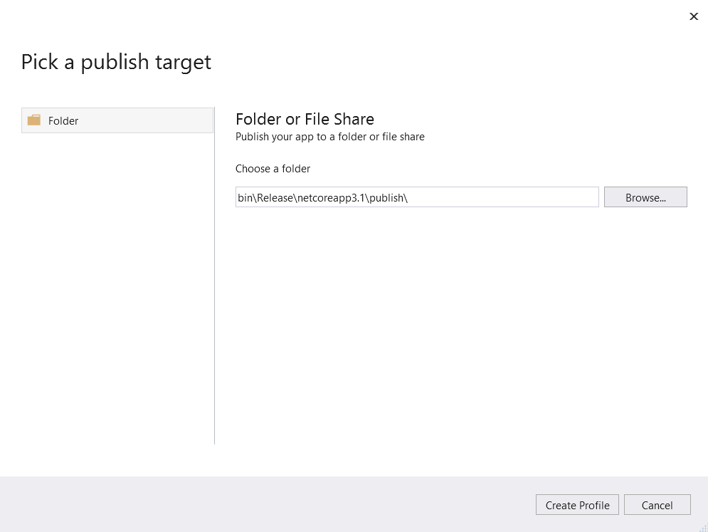
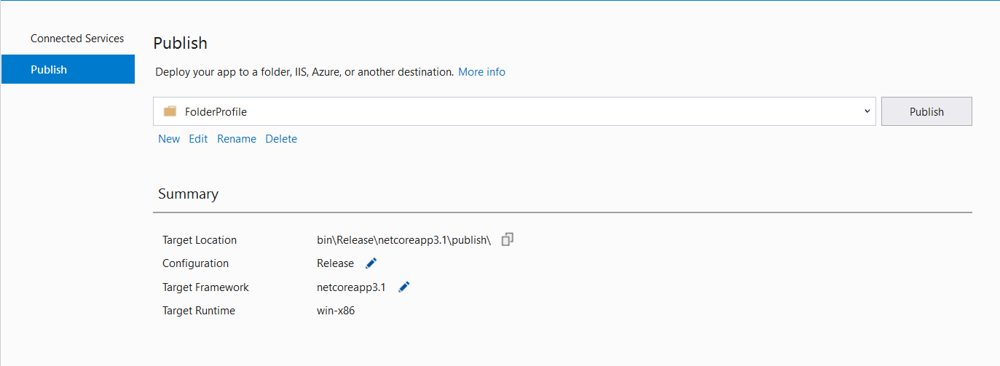
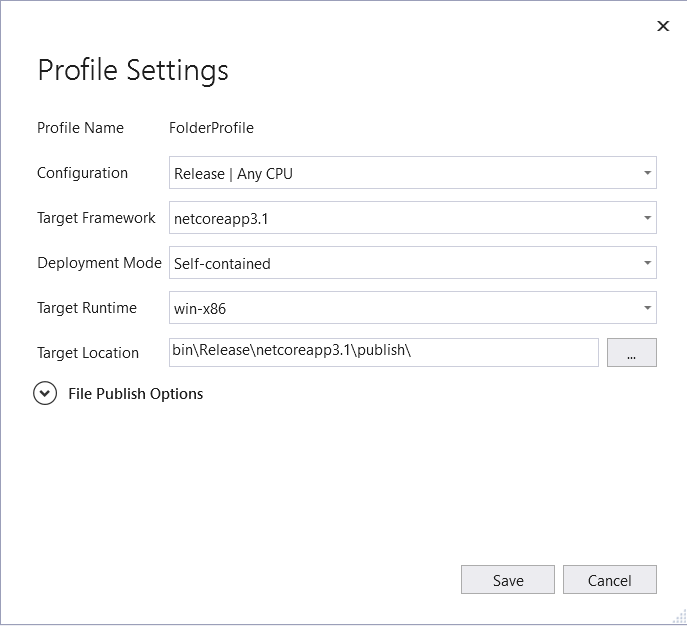
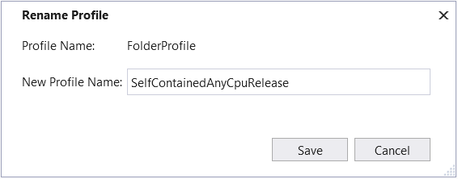

# DevOps for Windows Desktop Apps Using GitHub Actions

### Create a CI/CD pipeline for a Windows Presentation Foundation (WPF) application built on .Net Core 3.x

This repo contains a sample application to demonstrate how to create a CI/CD pipeline for a WPF application built on .Net Core 3.x and packaged with MSIX using GitHub Actions. 

With GitHub Actions, you can automate your software workflows.  You can build, test, and deploy your code within GitHub.  Documentation for GitHub Actions can be found [here](https://github.com/features/actions).


## Workflows

Workflows are defined in YAML files in the .github/workflows folder.  In this project, we have two workflow definitions:
* **ci.yml:** This file defines the steps for our Continuous Integration pipeline.
* **cd.yml:** This file defines the steps for our Continuous Delivery pipeline.

### ci.yml: Build, test, package, and save the package artifacts.

On every `push` to the repo, [Install .NET Core](https://github.com/actions/setup-dotnet), add [MSBuild](https://github.com/topics/msbuild-action) to the PATH, and execute unit tests.

```yaml
    - name: Install .NET Core
      uses: actions/setup-dotnet@v1
      with:
        dotnet-version: 3.1.100

    # Add  MsBuild to the PATH: https://github.com/topics/msbuild-action
    - name: Setup MSBuild.exe
      uses: warrenbuckley/Setup-MSBuild@v1
      
    # Test
    - name: Execute Unit Tests
      run: dotnet test $env:Test_Project_Path
```

Target multiple platforms by authoring the workflow to define a Build Matrix, a set of different configurations for the runner environment. Define [environment variables](https://help.github.com/en/actions/automating-your-workflow-with-github-actions/using-environment-variables) for use by the workflow. 

```yaml
    strategy:
      matrix:
        targetplatform: [x86, x64]

    runs-on: windows-latest

    env:
      SigningCertificate: GitHubActionsDemo.pfx
      Solution_Path: MyWpfApp.sln
      Test_Project_Path: MyWpfApp.Tests\MyWpfApp.Tests.csproj
      Wpf_Project_Path: MyWpfApp\MyWpfApp.csproj
      Wap_Project_Directory: MyWpfApp.Package
      Wap_Project_Name: MyWpfApp.Package.wapproj
```

Build and package the Wpf Net Core application with MsBuild.  Restore the project prior to build in order to take advantage of Publish Profiles (see below).
```yaml
    # Restore the application
    - name:  Restore the Wpf application to populate the obj folder
      run: msbuild $env:Wpf_Project_Path /p:Configuration=$env:Configuration /p:RuntimeIdentifier=$env:RuntimeIdentifier
      env:
        Configuration: Release
        RuntimeIdentifier: win-${{ matrix.targetplatform }}
    
    # Build the Windows Application Packaging project
    - name: Build the Windows Application Packaging Project (wapproj) 
      run: msbuild $env:Solution_Path /p:Platform=$env:TargetPlatform /p:Configuration=$env:Configuration /p:UapAppxPackageBuildMode=$env:BuildMode /p:AppxBundle=$env:AppxBundle /p:PackageCertificateKeyFile=$env:SigningCertificate /p:PackageCertificatePassword=${{ secrets.Pfx_Key }}
      env:
        AppxBundle: Never
        BuildMode: SideLoadOnly
        Configuration: Release
        TargetPlatform: ${{ matrix.targetplatform }}
```
See the article ["Workflow Syntax for GitHub Actions"](https://help.github.com/en/actions/automating-your-workflow-with-github-actions/workflow-syntax-for-github-actions) for more information.

Build and package the WPF .Net Core application with MSBuild and then [upload the build artifacts](https://github.com/marketplace/actions/upload-artifact) to deploy and test the application.

The CI pipeline uses the Package Identity Name defined in the Package.appxmanifest in the Windows Application Packaging project to identify the application as "MyWPFApp.DevOpsDemo.Local." By suffixing the application with ".Local," developers are able to install it side by side with other channels of the app.

```xml
  <Identity
    Name="MyWPFApp.DevOpsDemo.Local"
    Publisher="CN=GitHubActionsDemo"
    Version="0.0.1.0" />
```

Developers have the option to download the artifact to test the build or upload the artifact to a website or file share for app distribution.  

### cd.yml: Build, package, and create a GitHub release for multiple channels

Build, package and distribute code for multiple channels such as 'Dev' and 'Prod.'   On every `push` to a [tag](https://git-scm.com/book/en/v2/Git-Basics-Tagging) matching the pattern `*`, [create a release](https://developer.github.com/v3/repos/releases/#create-a-release) and [upload a release asset](https://developer.github.com/v3/repos/releases/#upload-a-release-asset).

```yaml
on: 
  push:
    tags:
      - '*'
```

To create a git `tag`, run the following commands on the branch you wish to release:
```cmd
git tag 1.0.0.0
git push origin --tags
```

The above commands will add the tag "1.0.0.0" and then `push` the branch and tag to the repo. [Learn more.](https://git-scm.com/book/en/v2/Git-Basics-Tagging)

In this workflow, the GitHub agent builds the WPF .Net Core application and creates a MSIX package. Prior to building the code, the application's Identity Name, Publisher, Application DisplayName, and other elements in the Package.appxmanifest are changed according to which channel should be built. 

```yaml
    # Update the appxmanifest before build by setting the per-channel values set in the matrix.
    - name: Update manifest version
      run: |
        [xml]$manifest = get-content ".\$env:Wap_Project_Directory\Package.appxmanifest"
        $manifest.Package.Identity.Version = "$env:NBGV_SimpleVersion.0"
        $manifest.Package.Identity.Name = "${{ matrix.MsixPackageId }}"
        $manifest.Package.Identity.Publisher = "${{ matrix.MsixPublisherId }}"
        $manifest.Package.Properties.DisplayName = "${{ matrix.MsixPackageDisplayName }}"
        $manifest.Package.Applications.Application.VisualElements.DisplayName = "${{ matrix.MsixPackageDisplayName }}"
        $manifest.save(".\$env:Wap_Project_Directory\Package.appxmanifest")
```
 
Channels and variables are defined in the Build Matrix and will build and create app packages for Dev, Prod_Sideload and Prod_Store.

```yaml
jobs:

  build:

    strategy:
      matrix:
        channel: [Dev, Prod_Sideload, Prod_Store]
        targetPlatform: [x86, x64]
        include:
          
          # includes the following variables for the matrix leg matching Dev
          - channel: Dev
            ChannelName: Dev
            Configuration: Debug
            DistributionUrl: https://microsoft.github.io/github-actions-for-desktop-apps-distribution-dev
            MsixPackageId: MyWPFApp.DevOpsDemo.Dev
            MsixPublisherId: CN=GitHubActionsDemo
            MsixPackageDisplayName: MyWPFApp (Dev)

          # includes the following variables for the matrix leg matching Prod_Sideload
          - channel: Prod_Sideload
            Configuration: Release
            ChannelName: Prod_Sideload
            DistributionUrl: https://microsoft.github.io/github-actions-for-desktop-apps-distribution-prod
            MsixPackageId: MyWPFApp.DevOpsDemo.ProdSideload
            MsixPublisherId: CN=GitHubActionsDemo
            MsixPackageDisplayName: MyWPFApp (ProdSideload)

          # includes the following variables for the matrix leg matching Prod_Store
          - channel: Prod_Store
            Configuration: Release
            ChannelName: Prod_Store
            DistributionUrl: 
            MsixPackageId: MyWPFApp.DevOpsDemo.ProdStore
            MsixPublisherId: CN=GitHubActionsDemo
            MsixPackageDisplayName: MyWPFApp (ProdStore)
```

The CD pipeline uses the Package Identity Name defined in the Package.appxmanifest in the Windows Application Packaging project to identify the application as *MyWPFApp.DevOpsDemo.Dev*, *MyWPFApp.DevOpsDemo.ProdSideload*, and *MyWPFApp.DevOpsDemo.ProdStore* depending on which channel is being built.

```xml
  <Identity
    Name="MyWPFApp.DevOpsDemo.ProdSideload"
    Publisher="CN=GitHubActionsDemo"
    Version="0.0.1.0" />
```

Once the MSIX is created for each channel, the agent archives the AppPackages folder then creates a Release with the specified git release tag.  The archive is uploaded to the release as an asset for storage or distribution.

```
    # Create the release:  https://github.com/actions/create-release
    - name: Create release
      id: create_release
      uses: actions/create-release@v1
      env:
        GITHUB_TOKEN: ${{ secrets.GITHUB_TOKEN }} # This token is provided by Actions, you do not need to create your own token
      with:
        tag_name: ${{ github.ref}}.${{matrix.ChannelName}}.${{ matrix.targetplatform }}
        release_name:  ${{ github.ref }}.${{ matrix.ChannelName }}.${{ matrix.targetplatform }}
        draft: false
        prerelease: false

    # Upload release asset:   https://github.com/actions/upload-release-asset
    - name: Update release asset
      id: upload-release-asset
      uses: actions/upload-release-asset@v1
      env:
        GITHUB_TOKEN: ${{ secrets.GITHUB_TOKEN }}
      with:
        upload_url: ${{ steps.create_release.outputs.upload_url }}  # This pulls from the CREATE RELEASE step above, referencing it's ID to get its outputs object, which include a `upload_url`. See this blog post for more info: https://jasonet.co/posts/new-features-of-github-actions/#passing-data-to-future-steps 
        asset_path: MyWpfApp.Package\AppPackages\AppPackages.zip
        asset_name: AppPackages.zip
        asset_content_type: application/zip

```

Creating channels for the application is a powerful way to create multiple distributions of an application in the same CD pipeline.

### Signing
Avoid submitting certificates to the repo if at all possible. (Git ignores them by default.) To manage the safe handling of sensitive files like certificates, take advantage of [GitHub secrets](https://help.github.com/en/actions/automating-your-workflow-with-github-actions/creating-and-using-encrypted-secrets), which allow the storage of sensitive information in the repository.

Generate a signing certificate in the Windows Application Packaging Project or add an existing signing certificate to the project and then use PowerShell to encode the .pfx file using Base64 encoding.

```pwsh
$pfx_cert = Get-Content '.\GitHubActionsDemo.pfx' -Encoding Byte
[System.Convert]::ToBase64String($pfx_cert) | Out-File `SigningCertificate_Encoded.txt'
```

Copy the string from the output file, *SigningCertificate_Encoded.txt*, and add it to the repo as a GitHub secret. [Add a secret to the workflow.](https://help.github.com/en/actions/automating-your-workflow-with-github-actions/virtual-environments-for-github-hosted-runners#creating-and-using-secrets-encrypted-variables)

In the workflow, add a step to decode the secret, save the .pfx to the build agent, and package your application with the Windows Application Packaging project.

```yaml
    # Decode the Base64 encoded Pfx
    - name: Decode the Pfx
      run: |
        $pfx_cert_byte = [System.Convert]::FromBase64String("${{ secrets.Base64_Encoded_Pfx }}")
        $currentDirectory = Get-Location
        $certificatePath = Join-Path -Path $currentDirectory -ChildPath $env:Wap_Project_Directory -AdditionalChildPath $env:SigningCertificate
        [IO.File]::WriteAllBytes("$certificatePath", $pfx_cert_byte)
```

Once the certificate is decoded and saved to the Windows Application Packaging Project, sign the package during packaging and pass the signing certificate's password to MSBuild.

```yaml
    # Build the Windows Application Packaging project for Dev and Prod_Sideload
    - name: Build the Windows Application Packaging Project (wapproj) for ${{ matrix.ChannelName }}
      run: msbuild $env:Wap_Project_Directory/$env:Wap_Project_Name /p:Platform=$env:TargetPlatform /p:Configuration=$env:Configuration /p:UapAppxPackageBuildMode=$env:BuildMode /p:GenerateAppInstallerFile=$env:GenerateAppInstallerFile /p:AppInstallerUri=$env:AppInstallerUri /p:PackageCertificateKeyFile=$env:SigningCertificate /p:PackageCertificatePassword=${{ secrets.Pfx_Key }}
      if: ${{ matrix.ChannelName }} != Prod_Store
      env:
        AppInstallerUri: ${{ matrix.DistributionUrl }}
        BuildMode: SideLoadOnly
        Configuration: ${{ matrix.Configuration }}
        GenerateAppInstallerFile: True
        TargetPlatform: ${{ matrix.TargetPlatform }}
```

Finally, delete the .pfx.

```yaml
    # Remove the .pfx
    - name: Remove the .pfx
      run: Remove-Item -path $env:Wap_Project_Directory/$env:SigningCertificate
      if: ${{ matrix.ChannelName }} != Prod_Store
```

### Versioning

The [Nerdbank.GitVersioning GitHub Action](https://github.com/AArnott/nbgv) sets the build version based on a combination of the included version.json file, and the git height of the version which is the number of commits in the longest path from HEAD to the commit that set the major.minor version number to the values found in the HEAD. Once the action runs, a number of environment variables are available for use, such as:

* NBGV_Version (e.g. 1.1.159.47562)
* NBGV_SimpleVersion (e.g. 1.1.159)
* NBGV_NuGetPackageVersion (e.g. 1.1.159-gcab9873dd7)
* NBGV_ChocolateyPackageVersion 
* NBGV_NpmPackageVersion

See the [Nerdbank.GitVersioning](https://github.com/aarnott/nerdbank.gitversioning) package for more information.


### Publisher Profiles
Publisher Profiles allow developers to reference publishing information about their application in the Windows Application Packaging Project.

To add a Publisher Profile, right click MyWpfApp and select Publish.  In the Publish dialog, select 'New.'  In the "Pick a publish target" dialog, choose the folder or file share to publish the app to and "Create Profile."




In the Publish dialog, click "Edit" to customize the profile settings.




Select the configuration, framework and runtime to target.  Select whether the deployment mode should be "Framework Dependent" or "Self-contained."




Edit the profile name to reflect the settings by clicking "Rename" in the Publish dialog.



In the packaging project, add a reference to the Publish Profile.  In the Solution Explorer, open MyWPFApp.Package and navigate to Applications.  Click on MyWFPApp.  In the properties window, select Publishing Profile.  The dropdown should be populated with the recently-created profile.


# Contributions
This project welcomes contributions and suggestions. Most contributions require you to agree to a Contributor License Agreement (CLA) declaring that you have the right to, and actually do, grant us the rights to use your contribution. For details, visit https://cla.microsoft.com.

When you submit a pull request, a CLA-bot will automatically determine whether you need to provide a CLA and decorate the PR appropriately (e.g., label, comment). Simply follow the instructions provided by the bot. You will only need to do this once across all repos using our CLA.

This project has adopted the Microsoft Open Source Code of Conduct. For more information see the Code of Conduct FAQ or contact opencode@microsoft.com with any additional questions or comments.

## License
The scripts and documentation in this project are released under the [MIT License](LICENSE)
